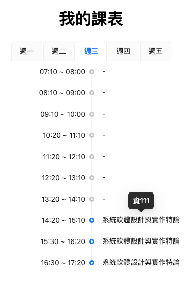

# My Class Schedule

我的課表, 這是一個簡單的課表, 用來記錄我的課程時間, 並且基於 PWA 可以被安裝到手機桌面上, 並且可以離線使用.

## 如何個人化設置

1. 修改 `public/data.json` 裡面的課程資料
2. 課程時間是基於 `src/utils/config.js` 裡面的 `timeNumber2String` 進行轉換, 你可以自行修改這個函數來適應你的課程時間,
   切勿調整格式
3. 針對 `src/utils/config.js` 裡面的 `timeNumber2String` 進行修改, 須按照總課堂數設置 `MaxTime` 的值

## 如何安裝 PWA

1. 進入網站
2. 點擊設置, 點擊加入主畫面
3. PWA 會自動判斷網站是否更新, 自行更新 APP

## 如何自行發布

`fork` 本專案即可, 有設置 CICD 自動部署到 Github Pages, 若失敗請設置相關權限

## Demo

